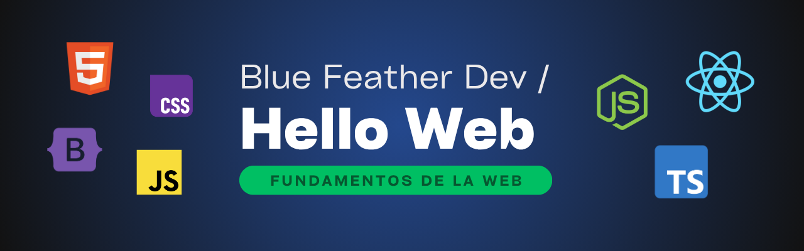

# Hello, Web!

Este repositorio es mi espacio personal de estudio sobre el **desarrollo web** y comprender sus fundamentos, tecnologías y buenas prácticas.

## 🔎 ¿Qué encontrarás aquí?

### 🗂️ Aprendizaje estructurado

- Etiquetas, estructura y maquetado

- Estilos, diseño responsivo y animaciones
- Lógica, manipulación del DOM y eventos
- Carpeta: [`learning/`](./learning/)

### 🧪 Pruebas personales

- Proyectos pequeños y pruebas rápidas

- Ejemplos creativos y curiosos encontrados en Internet
- Carpeta: [`playground/`](./playground/)

### 🎓 Uso en la universidad

- Ejercicios académicos sobre desarrollo web

- Proyectos desarrollados para distintas asignaturas
- Carpeta: [`cuc/`](./cuc/)

## 🎯 Objetivos del repositorio

- Sistematizar mis conocimientos en los **fundamentos** del desarrollo web 

- Practicar integración de tecnologías **frontend** y **backend**  
- Explorar librerías y **frameworks** populares

> Made with '\u{2665}' (♥)
